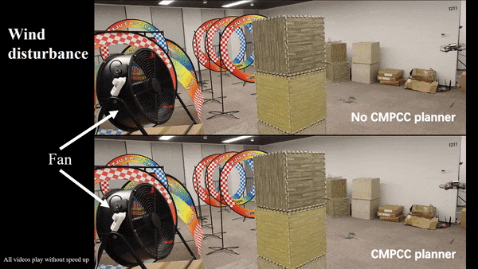

# CMPCC
Corridor-based Model Predictive Contouring Control for Aggressive Drone Flight

## 0. Overview
**CMPCC** is an efficient, receding horizon, local adaptive low level planner as the middle layer between our original planner and controller [trr](https://github.com/USTfgaoaa/Teach-Repeat-Replan). 

**Author**: Jialin Ji, Xin Zhou and [Fei Gao](https://ustfei.com/) from the [ZJU Fast Lab](www.kivact.com/). 

**Related Paper**: [CMPCC: Corridor-based Model PredictiveContouring Control for Aggressive Drone Flight](https://arxiv.org/abs/2007.03271), Jialin Ji, Xin Zhou, Chao Xu, Fei Gao, accepted, International Symposium on Experimental Robotics (ISER 2020).

**Video Links**: [youtube](https://www.youtube.com/watch?v=_7CzBh-0wQ0) or [bilibili](https://www.bilibili.com/video/BV1cZ4y1u7Ur)




### Features
-  online flight speed optimization
-  strict safety and feasibility
-  real-time performance
### File Structure
- **src/cmpcc**: key module of CMPCC, which is a single ros package 
- **src/simualtion**: a lightweight simulator for quadrotors 
- **src/utils**: some functional codes and plugins
- **osqp**: a copy of [OSQP](https://osqp.org/) source code for solving qp problem.


## 1. Prerequisites
Our software is developed and tested in Ubuntu 18.04, ROS Melodic. Other version may require minor modification. 

You can clone this repository: 
```
git clone https://github.com/KennethYangle/CMPCC.git
cd CMPCC
```
To install the following dependencies, you can run the auto-install script by
```
chmod +x install_tools.sh
./install_tools.sh
```

If failed, you can manually install them one by one:
- install dependencies
```
sudo apt-get install libyaml-cpp-dev
sudo apt-get install libarmadillo-dev
```

- install osqp
```
cd osqp
mkdir build
cd build
cmake -G "Unix Makefiles" ..
cmake --build .
sudo cmake --build . --target install
```

- install Eigen
```
  cd Eigen
  mkdir build
  cd build
  cmake ..
  make
  sudo make install
```

## 2. Build on ROS
After the prerequisites are satisfied, you can catkin_make in this repository directory, which is already a ros-workspace:
```
catkin_make --pkg swarm_msgs
catkin_make
``` 

## 3. Run the Simulation
Copy the `_ShootBall` folder to Windows and change the IP correspondingly. Double click `client_ue4_SITL.bat` to run it.

On Linux,
```
source devel/setup.bash
./_scripts/all.sh -s
```

## 4. Licence
The source code is released under [GPLv3](http://www.gnu.org/licenses/) license.

## 5. Maintaince

For any technical issues, please contact Jialin JI (jlji@zju.edu.cn) or Fei GAO (fgaoaa@zju.edu.cn).

For commercial inquiries, please contact Fei GAO (fgaoaa@zju.edu.cn).
